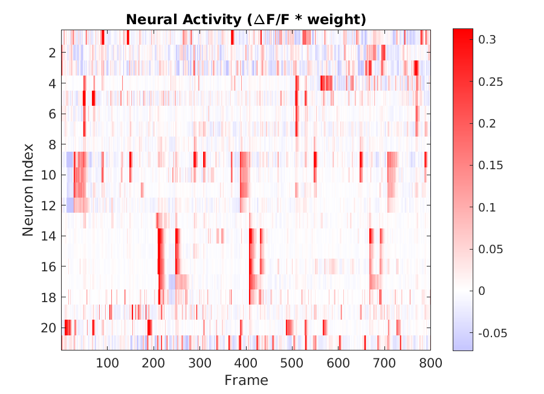

 <p>&nbsp;</p>

# DynamicNeuronTracker (DyNT)

1. ***DynamicNeuronTracker*** extracts dynamic Region-Of-Interests (ROIs) to accurately segment jittering and flickering single neurons in 3D calcium imaging of deforming tissues. 
2. This neuron segmentation method is designed for the case when tissue deformation is complicated so that the calcium images cannot be well-registered and single neuron locations are not static over time.
3. The package is built on Matlab (ver. 2020a).
4. The algorithm utilizes local patch-matching via spatial correlation to track jittering and flickering neurons in a 3D calcium movie. 

## Toy example of tracked and segmented neurons

> Maximum intensity projection video and overlaid dynamic ROIs

https://github.com/JungsikNoh/DynamicNeuronTracker/assets/38955889/b3b84c60-8b68-43b3-b31d-52c7a397e6f8

> Normalized neuron activity time courses


## Installation

Git-clone the repository into your Matlab working directory and add its subdirectories to the Matlab path: 
```
git clone https://github.com/JungsikNoh/DynamicNeuronTracker.git
```

## Demo pipeline

- Try running a [Demo pipeline](DynamicNeuronTrackerPackage/DynamicNeuronTracker/Demo_Pipeline_Data/Demo_toy_data_Pipeline_DyNT.m).
- `./DynamicNeuronTrackerPackage/DynamicNeuronTracker/Demo_Pipeline_Data` contains an example toy data and its DyNT output.

## Main pipeline
- The main pipeline is [Pipeline_DyNT.m](DynamicNeuronTrackerPackage/DynamicNeuronTracker/Pipelines/Pipeline_DyNT.m).
- End-to-end steps of DyNT pipeline consists of the following 6 steps:
  - Create a movieData object from a video data (tif file(s)) which contains the video information like the path, img sizes, pixel sizes, etc.
  - DetectBrightPointSources()
  - TrackJitteringFlickering()
  - SegmentDynamicROIs()
  - VisualizeActivityMapMasksIndexedByHCL()
  - DetermineResponsiveness() (*Optional*, only when stimulation info is available)
- DyNT depends on two Matlab packages, which are for movie data management and for tracking particles in 3D movies ([u-track3D](https://github.com/DanuserLab/u-track3D), [Roudot et al., 2020](https://www.biorxiv.org/content/10.1101/2020.11.30.404814v2)). Those packages are included in `DynamicNeuronTrackerPackage/requiredPackages_fromDanuserLab/`.
- To analyze a 3D calcium movie, start with creating a 'movieData' object to register the imaging data information.
  - For a guide to 'movieData' creatation,
    - You can refer to the first part of the [u-track3D guide](https://github.com/DanuserLab/u-track3D#getting-started-and-loading-data).
    - Or you can also refer to [a manual](Doc/TFMPackage.pdf) from [Danuser Lab repositories](https://github.com/DanuserLab?tab=repositories).
  - A 'movieData' object can be simply created by using a GUI or command lines:
    - using a GUI: You can type/enter `movieSelectorGUI()` to start the GUI, then click 'New'.
    - or using the command lines in the first section of the [Demo pipeline](DynamicNeuronTrackerPackage/DynamicNeuronTracker/Demo_Pipeline_Data/Demo_toy_data_Pipeline_DyNT.m).

## Parallel segmentation with sub-volume videos 
- If a single 3D calcium movie is too big to analyze in a single batch, then you can utilize [Pipeline_toGenerate_8subvolumeData_and_combineSeparateAnalysisResults.m](DynamicNeuronTrackerPackage/DynamicNeuronTracker/Pipelines/Pipeline_toGenerate_8subvolumeData_and_combineSeparateAnalysisResults.m) to divide an original volume into 8 sub-volumes,
process each sub-volume video, and combine the sub-volume outputs. 

## More information
- [Output examples](Doc/outputExamples.pdf) of DyNT


## Contact

Jungsik Noh (jungsik.noh@utsouthwestern.edu)


